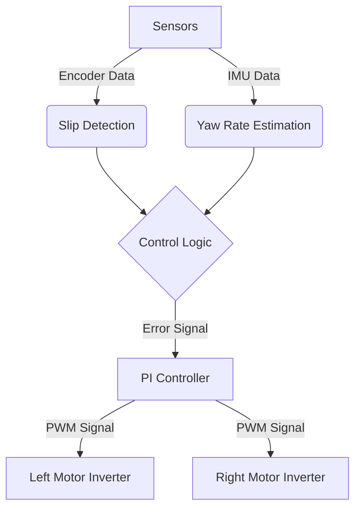

# EV-Torque-Vectoring-Control

# Real-Time EV Torque Vectoring System

**Role:** Control Systems / Software | **Context:** Electric Vehicle Design Course - APS380 (Group Project)

## Project Overview
Designed and implemented an Electronic Differential System (EDS) for a prototype electric vehicle. The system integrates sensor fusion with a real-time control loop to optimize vehicle stability and traction during cornering and slip events.

## Tech Stack
* **Hardware:** Microcontroller (ESP32-WROOM-32), Brushless Motors for the Wheels and Servo for Steering, Wheel Encoders, IMU
* **Algorithms:** PI Control, Slip Ratio Calculation
* **Language:** Python

## System Architecture

## Images

**Final Look** 

**Electrical Design**

* 4S 14.8 V LiPo battery (100C), high-discharge capable
* Rear BLDC motors driven by 40A bidirectional ESCs
* Buck converter supplies 5V for microcontroller + servo
* ESP32-C6 handles real-time control, PWM generation, and logging
* Wheel-speed measurement via magnetic encoders through TCA multiplexer
* MPU6050 IMU powered from ESP32 3.3V rail

**Mechanical Design**

* 3D-printed tricycle-style chassis for simplicity and low C.G.
* Two independent rear BLDC motors + custom 10:1 planetary gearboxes
* Free-rolling front wheel with servo-driven steering gear
* Modular design allows fast iteration and easy repair
* Sensors mounted to minimize vibration and maintain alignment

**Slip Test**

Figure 1: RPM vs time of right and left wheels when right wheel is slowed (induced full slip)

Figure 2: RPM vs time of right & left wheels when right wheel is taped (induced limited slip)

Induced slip by:
* Manually restraining one wheel, then releasing
* Adding tape to reduce traction

* Log right/left encoder RPM data
* Observe controller response during transient slip
* Compare baseline vs eLSD behaviour

https://github.com/user-attachments/assets/51244c50-5d0f-4ddc-b797-d0d481230f1a

